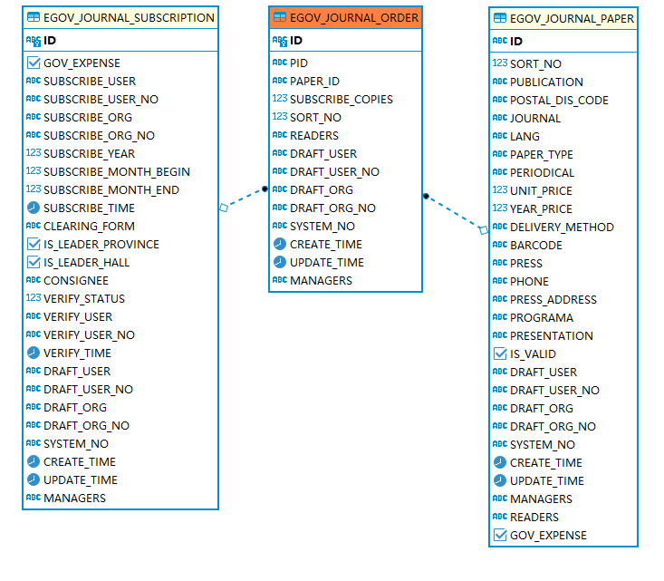

# fjszf-journal

报刊征订

### 初始化RDB TABLE

#### 报刊信息表

```sql
CREATE TABLE EGOV_JOURNAL_PAPER
(
    ID              VARCHAR(32)           NOT NULL,
    SORT_NO         INT     DEFAULT 1,              --排序号
    PUBLICATION     VARCHAR(256)          NOT NULL, --报刊名称
    POSTAL_DIS_CODE VARCHAR(100)          NOT NULL, --邮发代号
    JOURNAL         VARCHAR(32)           NOT NULL, --报纸/期刊
    LANG            VARCHAR(32)           NOT NULL, --语言，默认中文
    PAPER_TYPE      VARCHAR(100),                   --类型
    PERIODICAL      VARCHAR(32),                    --刊期：周刊、季刊、半年刊、月刊、年刊
    UNIT_PRICE      DECIMAL(10, 2)        NOT NULL, --价格
    YEAR_PRICE      DECIMAL(10, 2)        NOT NULL, --年价
    DELIVERY_METHOD VARCHAR(100)          NOT NULL, --订阅路径：默认 邮发
    BARCODE         VARCHAR(100),                   --条码号
    PRESS           VARCHAR(128),                   --出版社
    PHONE           VARCHAR(128),                   --联系电话
    PRESS_ADDRESS   VARCHAR(258),                   --出版社地址
    PROGRAMA        VARCHAR(128),                   --栏目
    PRESENTATION    VARCHAR(512),                   --介绍
    GOV_EXPENSE     boolean DEFAULT FALSE NOT NULL, --公费刊物
    IS_VALID        boolean DEFAULT TRUE  NOT NULL, --是否有效
    REQUISITE       boolean DEFAULT FALSE NOT NULL, --是否必订阅刊物
    PRODUCT_ID      VARCHAR(32),                    --产品号
    MEMO            CLOB,                      --备注
    READERS         VARCHAR(64),                    --["*"] 所有人可见

    DRAFT_USER      VARCHAR(64),
    DRAFT_USER_NO   VARCHAR(16),
    DRAFT_ORG       VARCHAR(64),
    DRAFT_ORG_NO    VARCHAR(16),
    SYSTEM_NO       VARCHAR(64),
    CREATE_TIME     TIMESTAMP,
    UPDATE_TIME     TIMESTAMP,
    MANAGERS        VARCHAR(512),                           --管理员，群组或角色
    CONSTRAINT CONS1342192229 PRIMARY KEY (ID)
);
CREATE INDEX EGOV_JOURNAL_PAPER_ID_IDX ON EGOV_JOURNAL_PAPER (ID,PUBLICATION,POSTAL_DIS_CODE,READERS,DRAFT_USER_NO,MANAGERS);
```

#### 报刊订阅表

##### 主表

```sql
-- DROP TABLE EGOV_NEWSPAPER_RSS;
CREATE TABLE EGOV_JOURNAL_SUBSCRIPTION
(
    ID                     VARCHAR(32)           NOT NULL,
    GOV_EXPENSE            BOOLEAN DEFAULT TRUE  NOT NULL, --订阅类型：自费，公费
    SUBSCRIBE_USER         VARCHAR(64),                    --订阅人
    SUBSCRIBE_USER_NO      VARCHAR(16),
    SUBSCRIBE_ORG          VARCHAR(64)           NOT NULL, --订阅处室
    SUBSCRIBE_ORG_NO       VARCHAR(16)           NOT NULL,
    SUBSCRIBE_YEAR         INT,                            --订阅年份
    SUBSCRIBE_MONTH_BEGIN  INT     DEFAULT 1,              --起始月订期
    SUBSCRIBE_MONTH_END    INT     DEFAULT 12,             --截至月订期
    SUBSCRIBE_TIME         TIMESTAMP,                      --订阅时间
    CLEARING_FORM          VARCHAR(64),--结算方式：现金或赠送，默认现金

    IS_LEADER_PROVINCE     BOOLEAN DEFAULT FALSE NOT NULL, --是否省领导
    IS_LEADER_HALL         BOOLEAN DEFAULT FALSE NOT NULL, --是否厅领导
    CONSIGNEE              VARCHAR(64),                    --收件对象：处室收文、个人收件，不要下拉，默认处室收件

    VERIFY_STATUS          INT     DEFAULT 0     NOT NULL, --审核状态：0-草稿，1-待审核，2-已审核
    VERIFY_USER            VARCHAR(64),                    --审核人
    VERIFY_USER_NO         VARCHAR(16),
    VERIFY_TIME            TIMESTAMP,                      --审核时间

    PUBLICATION_BRIEF      CLOB,                           --刊物信息摘要
    SUBSCRIBE_COPIES_BRIEF INT,                            --份数摘要
    AMOUNT_BRIEF           DECIMAL(20, 2),                 --金额摘要

    DRAFT_USER             VARCHAR(64)           NOT NULL,
    DRAFT_USER_NO          VARCHAR(16)           NOT NULL,
    DRAFT_ORG              VARCHAR(64),
    DRAFT_ORG_NO           VARCHAR(16),
    SYSTEM_NO              VARCHAR(64),
    CREATE_TIME            TIMESTAMP,
    UPDATE_TIME            TIMESTAMP,
    MANAGERS               VARCHAR(512),                           --管理员，群组或角色
    CONSTRAINT CONS13421464262 PRIMARY KEY (ID)
);
CREATE INDEX EGOV_JOURNAL_SUBSCRIPTION_ID_IDX ON EGOV_JOURNAL_SUBSCRIPTION (ID,SUBSCRIBE_USER_NO,VERIFY_USER_NO,DRAFT_USER_NO,MANAGERS,SUBSCRIBE_ORG_NO);
```

##### 刊物信息子表

```sql
-- Drop table
-- DROP TABLE FJSZF.EGOV_JOURNAL_ORDER;
CREATE TABLE EGOV_JOURNAL_ORDER
(
    PID              VARCHAR(32)           NOT NULL, --外键
    ID               VARCHAR(32)           NOT NULL, --ID
    PAPER_ID         varchar(32)           NOT NULL, --关联刊物信息及价格
    SUBSCRIBE_COPIES int                   NOT NULL, --订阅份数
    SORT_NO          INT     DEFAULT 1,              --排序号
    READERS          VARCHAR(64),                    --["*"] 所有人可见
    DISPATCHED       BOOLEAN DEFAULT FALSE NOT NULL, --是否已分发

    DRAFT_USER       VARCHAR(64),
    DRAFT_USER_NO    VARCHAR(16),
    DRAFT_ORG        VARCHAR(64),
    DRAFT_ORG_NO     VARCHAR(16),
    SYSTEM_NO        VARCHAR(64),
    CREATE_TIME      TIMESTAMP,
    UPDATE_TIME      TIMESTAMP,
    MANAGERS         VARCHAR(512),                           --管理员，群组或角色

    CONSTRAINT CONS13429642362 PRIMARY KEY (ID),
    CONSTRAINT EGOV_JOURNAL_ORDER_FK_PID FOREIGN KEY (PID) REFERENCES EGOV_JOURNAL_SUBSCRIPTION (ID) ON DELETE CASCADE,
    CONSTRAINT EGOV_JOURNAL_ORDER_FK_PAPER_ID FOREIGN KEY (PAPER_ID) REFERENCES EGOV_JOURNAL_PAPER (ID)
);
CREATE INDEX EGOV_JOURNAL_ORDER_PID_IDX ON EGOV_JOURNAL_ORDER (PID,ID,PAPER_ID,READERS,MANAGERS,DRAFT_USER_NO);
```



#### 统计打印参数配置

```sql
CREATE TABLE EGOV_JOURNAL_STAT_PRINT_CONFIG
(
    ID            VARCHAR(32)  NOT NULL,
    SORT_NO       INT DEFAULT 1,         --排序号
    COMPANY       VARCHAR(100) NOT NULL, --单位名称
    POSTAL_CODE   VARCHAR(100),          --邮编
    TRANSACTOR    VARCHAR(100) NOT NULL, --经办人
    PHONE_NO      VARCHAR(100) NOT NULL, --电话
    ADDRESS       VARCHAR(256) NOT NULL, --通信地址

    READERS       VARCHAR(100),          --["*"] 所有人可见

    DRAFT_USER    VARCHAR(64),
    DRAFT_USER_NO VARCHAR(16),
    DRAFT_ORG     VARCHAR(64),
    DRAFT_ORG_NO  VARCHAR(16),
    SYSTEM_NO     VARCHAR(64),
    CREATE_TIME   TIMESTAMP,
    UPDATE_TIME   TIMESTAMP,
    MANAGERS      VARCHAR(512),                  --管理员，群组或角色
    CONSTRAINT CONS1342192339 PRIMARY KEY (ID)
);
CREATE INDEX EGOV_JOURNAL_STAT_PRINT_CONFIG_ID_IDX ON EGOV_JOURNAL_STAT_PRINT_CONFIG (ID,DRAFT_USER_NO,MANAGERS,READERS);
```

#### 订阅限定配置

```sql
CREATE TABLE EGOV_JOURNAL_ORDER_LIMIT
(
    ID              VARCHAR(32)    NOT NULL,
    SUBSCRIBE_YEAR  INT            NOT NULL,                        --订阅年份
    SUBSCRIBE_BEGIN TIMESTAMP      NOT NULL,                        --起始月订期
    SUBSCRIBE_END   TIMESTAMP      NOT NULL DEFAULT 12,             --截至月订期

    LIMIT_COUNT     INT            NOT NULL DEFAULT 0,              --刊数
    LIMIT_COPIES    INT            NOT NULL DEFAULT 0,              --报数
    LIMIT_AMOUNT    DECIMAL(10, 2) NOT NULL DEFAULT 0,              --价格
    COMPANY         VARCHAR(100)   NOT NULL,
    SORT_NO         INT            NOT NULL DEFAULT 1,              --排序号

    IS_VALID        boolean                 DEFAULT TRUE NOT NULL,  --是否有效
    REQUISITE       boolean                 DEFAULT FALSE NOT NULL, --是否必订阅刊物
    REPEAT_VERIFY   INT                     DEFAULT 1 NOT NULL,     --重复验证方式，0-无, 1-按订阅处室，2-按订阅处室+订阅人

    READERS         VARCHAR(100),                                   --["*"] 所有人可见

    DRAFT_USER      VARCHAR(64),
    DRAFT_USER_NO   VARCHAR(16),
    DRAFT_ORG       VARCHAR(64),
    DRAFT_ORG_NO    VARCHAR(16),
    SYSTEM_NO       VARCHAR(64),
    CREATE_TIME     TIMESTAMP,
    UPDATE_TIME     TIMESTAMP,
    MANAGERS        VARCHAR(512),                                           --管理员，群组或角色
    CONSTRAINT CONS1342192349 PRIMARY KEY (ID)
);
CREATE INDEX EGOV_JOURNAL_ORDER_LIMIT_ID_IDX ON EGOV_JOURNAL_ORDER_LIMIT (ID,READERS,DRAFT_USER_NO,MANAGERS);
```

#### 模块配置

```sql
CREATE TABLE EGOV_JOURNAL_DB_CONFIG
(
    ID               VARCHAR(32) NOT NULL,

    PANEL_URL        CLOB,                            --分发接口地址
    PANEL_HORIZONTAL INT         NOT NULL DEFAULT 5,  --分发面板水平数量
    PANEL_VERTICAL   INT         NOT NULL DEFAULT 10, --分发面板垂直数量
    PANEL_ITEMS      CLOB,                            --分发面板选项相关配置信息，刊物名，邮发代号。分发时以邮发代号为关联

    READERS          VARCHAR(100),                    --["*"] 所有人可见

    DRAFT_USER       VARCHAR(64),
    DRAFT_USER_NO    VARCHAR(16),
    DRAFT_ORG        VARCHAR(64),
    DRAFT_ORG_NO     VARCHAR(16),
    SYSTEM_NO        VARCHAR(64),
    CREATE_TIME      TIMESTAMP,
    UPDATE_TIME      TIMESTAMP,
    MANAGERS         VARCHAR(512),                            --管理员，群组或角色
    CONSTRAINT CONS1342192350 PRIMARY KEY (ID)
);
CREATE INDEX EGOV_JOURNAL_DB_CONFIG_ID_IDX ON EGOV_JOURNAL_DB_CONFIG (ID,DRAFT_USER_NO,DRAFT_ORG_NO,MANAGERS);
```

### ACL角色及管理

#### 管理员配置

```yaml
rongji:
  module:
    journal:
      managers:
        - journal_manager
        - sys_manager
```

### 更新

#### 2021-09-17

##### 表 EGOV_JOURNAL_PAPER 增加字段

```sql
ALTER TABLE EGOV_JOURNAL_PAPER
    ADD REQUISITE boolean DEFAULT FALSE NOT NULL;

ALTER TABLE EGOV_JOURNAL_ORDER_LIMIT
    ADD SORT_NO int DEFAULT 1 NOT NULL;


-- 2021/10/11
ALTER TABLE EGOV_JOURNAL_ORDER_LIMIT
    ADD IS_VALID boolean DEFAULT TRUE NOT NULL;
ALTER TABLE EGOV_JOURNAL_ORDER_LIMIT
    ADD REQUISITE boolean DEFAULT TRUE NOT NULL;

ALTER TABLE EGOV_JOURNAL_PAPER MODIFIES PERIODICAL NULL;


-- 2021/10/19
ALTER TABLE EGOV_JOURNAL_PAPER
    ADD PRODUCT_ID VARCHAR(32);
ALTER TABLE EGOV_JOURNAL_PAPER
    ADD MEMO CLOB;

-- 2021/11/17
ALTER TABLE EGOV_JOURNAL_ORDER_LIMIT
    ADD REPEAT_VERIFY INT DEFAULT 1 NOT NULL
--重复验证方式，0-无, 1-按订阅处室，2-按订阅处室+订阅人


-- 2021/11/20
ALTER TABLE EGOV_JOURNAL_SUBSCRIPTION
    ADD PUBLICATION_BRIEF CLOB; --刊物信息摘要
ALTER TABLE EGOV_JOURNAL_SUBSCRIPTION
    ADD SUBSCRIBE_COPIES_BRIEF INT; --份数摘要
ALTER TABLE EGOV_JOURNAL_SUBSCRIPTION
    ADD AMOUNT_BRIEF DECIMAL(20, 2);
--金额摘要

-- 更新摘要
UPDATE EGOV_JOURNAL_SUBSCRIPTION AS src
SET (PUBLICATION_BRIEF, SUBSCRIBE_COPIES_BRIEF, AMOUNT_BRIEF) = (
    SELECT group_concat(paper.PUBLICATION)                AS PUBLICATION_BRIEF,
           sum(order.SUBSCRIBE_COPIES)                    AS SUBSCRIBE_COPIES_BRIEF,
           sum(paper.YEAR_PRICE * order.SUBSCRIBE_COPIES) AS AMOUNT_BRIEF
    FROM EGOV_JOURNAL_SUBSCRIPTION AS subscription
             LEFT JOIN (EGOV_JOURNAL_ORDER AS order LEFT JOIN EGOV_JOURNAL_PAPER AS paper ON order.PAPER_ID = paper.ID) ON subscription.id = order.PID
    WHERE SUBSCRIPTION.id = src.id
);

-- 2021/11/23
ALTER TABLE EGOV_JOURNAL_ORDER
    ADD DISPATCHED BOOLEAN DEFAULT FALSE NOT NULL;
--是否已分发

-- 2021/11/24
ALTER TABLE EGOV_JOURNAL_DB_CONFIG
    MODIFY PANEL_URL VARCHAR(1000); --分发接口地址
```